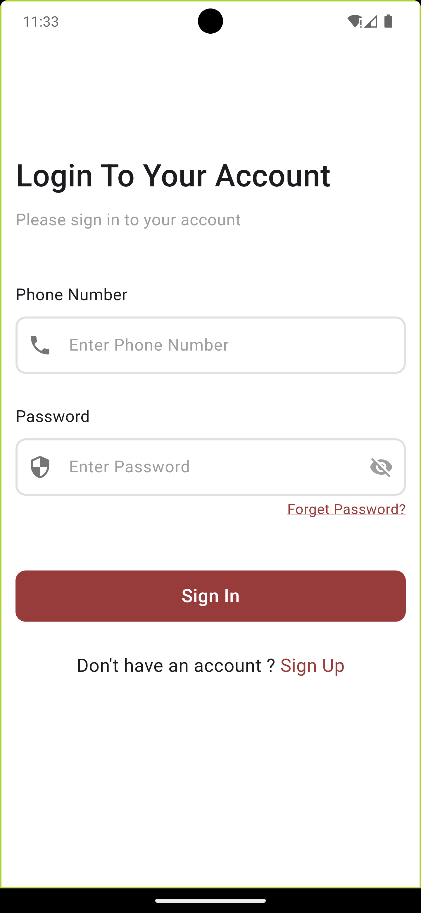
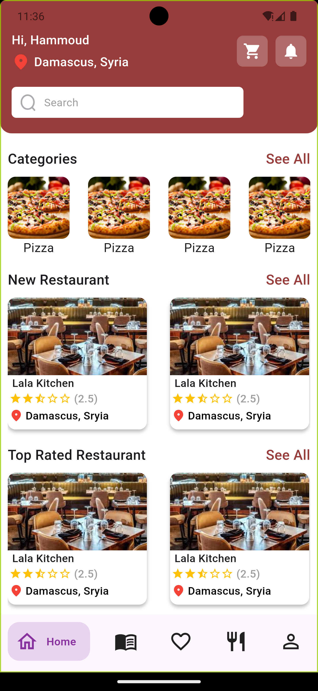
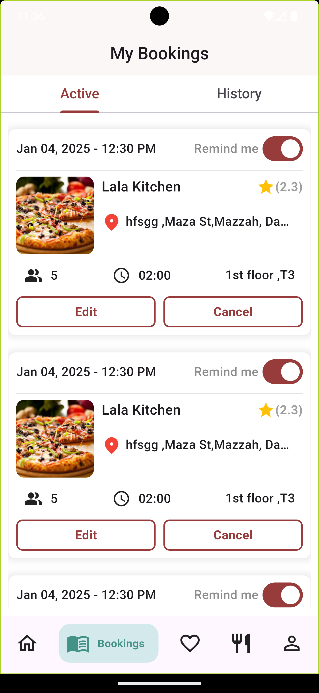
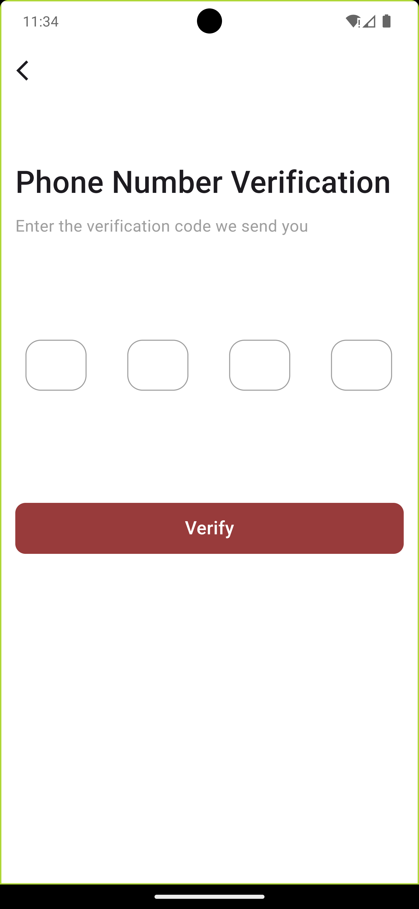
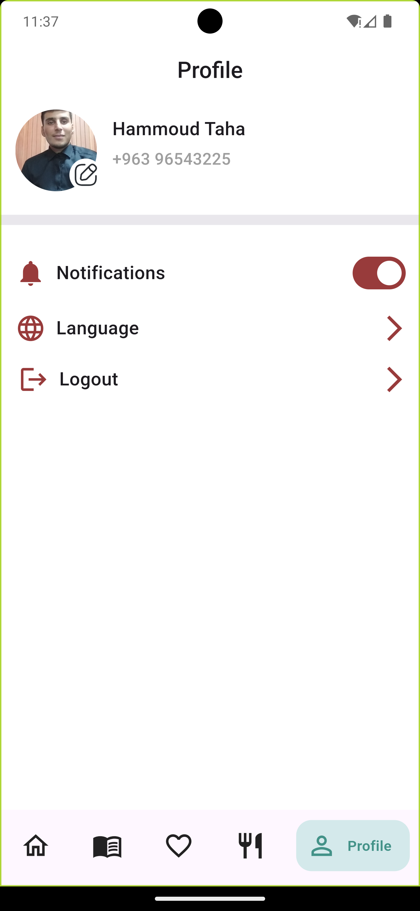
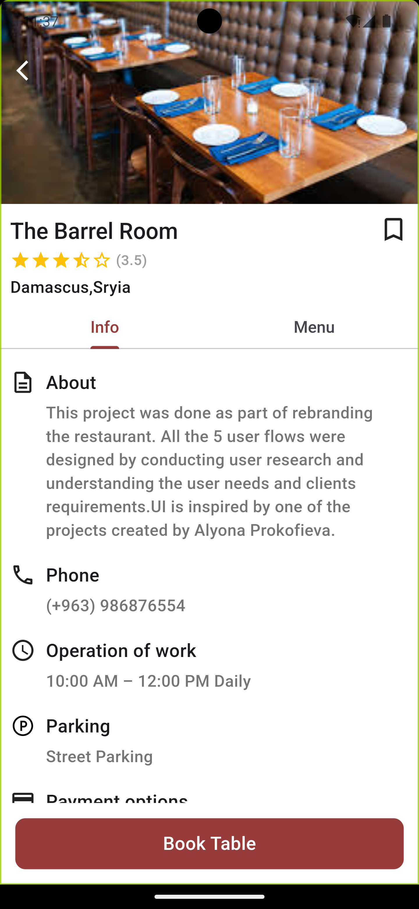
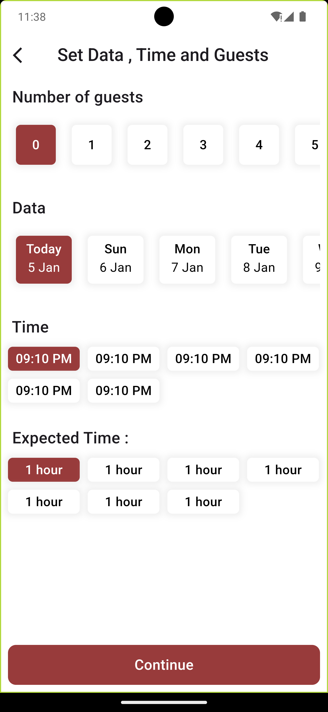

markdown name=README.md

# RMS Mobile — Restaurant Management System (Flutter)

**RMS Mobile** is a **Flutter** mobile application for running day‑to‑day restaurant operations as part of a **Restaurant Management System (RMS)**. It provides a fast, modern interface for managing orders, tables, menu items, and staff workflows on **Android** and **iOS**.

---

## Table of Contents

- [Overview](#overview)
- [Key Features](#key-features)
- [Tech Stack](#tech-stack)
- [Screenshots](#screenshots)
- [Prerequisites](#prerequisites)
- [Run Locally](#run-locally)
- [Configuration](#configuration)
- [Build & Release](#build--release)
- [Project Structure](#project-structure)
- [Quality & Testing](#quality--testing)
- [Contributing](#contributing)
- [License](#license)
- [Support](#support)

---

## Overview

RMS Mobile helps restaurant teams manage operational tasks from taking orders to tracking their status and organizing tables. The app can be connected to a backend/API (depending on your system architecture) to synchronize data and keep the restaurant workflow consistent across devices.

> Note: The exact modules available depend on how the backend and roles are implemented in your project.

---

## Key Features

- **Order management** (create / update / track status)
- **Table management** (available / occupied / reserved)
- **Menu management** (items, categories, add-ons/modifiers)
- **Staff workflows & access control** (if enabled)
- Fast **search & filtering** for orders and items
- Cross‑platform support: **Android** + **iOS** from a single codebase

---

## Tech Stack

- **Flutter / Dart** (primary)
- Native/platform components (depending on dependencies/plugins):
  - **Swift** (iOS)
  - **C / C++ / CMake** (native dependencies)

---

## 🖼Some Screenshots

| login                               | home                                | Bookings                            | Favorites                            |
| ----------------------------------- | ----------------------------------- | ----------------------------------- | ------------------------------------ |
|  |  |  |  |

| OTP                                 | Profile                              | Restaurant                           | Reservation                          |
| ----------------------------------- | ------------------------------------ | ------------------------------------ | ------------------------------------ |
|  |  |  |  |

---

## Prerequisites

- Flutter SDK (latest stable recommended)
- Android Studio or VS Code
- Xcode (for iOS builds on macOS)

Verify your setup:

bash
flutter --version
flutter doctor

---

## Run Locally

1. Clone the repository:

bash
git clone https://github.com/HammoudTaha/RMS-Mobile.git
cd RMS-Mobile

2. Install dependencies:

bash
flutter pub get

3. Run the app:

bash
flutter run

---

## Configuration

Your app may require environment configuration such as an API base URL, feature flags, or third‑party keys.

Recommended approaches (use what matches your project):

- --dart-define variables
- A config file (e.g., `lib/config/env.dart`)

Example:

bash
flutter run --dart-define=BASE_URL=https://api.example.com

> Update this section to reflect the **actual** configuration approach used in the codebase.

---

## Build & Release

### Android (APK)

bash
flutter build apk --release
``

### Android (App Bundle)

bash
flutter build appbundle --release

### iOS

bash
flutter build ios --release

> For iOS, make sure Signing & Capabilities are configured in Xcode.

---

## Project Structure

Common directories you may find:

- `lib/` — Flutter application source code
- `assets/` — images, fonts, and static resources (if used)
- `android/` — Android native project
- `ios/` — iOS native project

---

## Quality & Testing

Run static analysis and tests:

bash
flutter analyze
flutter test

---

## Contributing

Contributions are welcome:

1. Fork the repo
2. Create a branch: `feature/your-feature-name`
3. Commit changes with a clear message
4. Open a Pull Request describing what changed and why

---

## License

Specify the license here (MIT / Apache-2.0 / GPL …), or state that it is currently **unlicensed**.

---

## Support

- Repository: https://github.com/HammoudTaha/RMS-Mobile
- For bugs or feature requests, please open a GitHub Issue with reproduction steps and logs.
